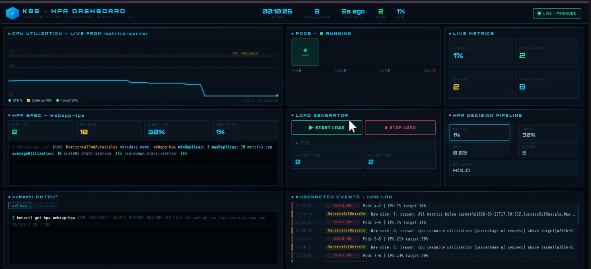
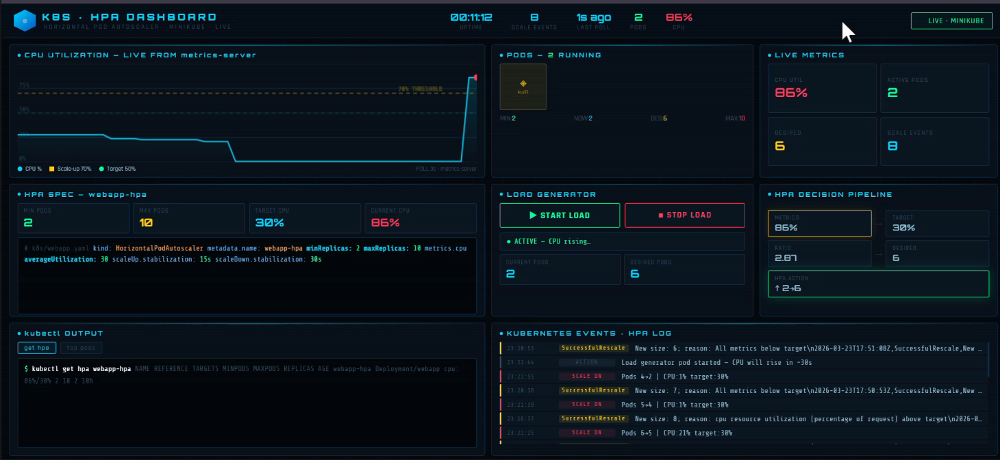
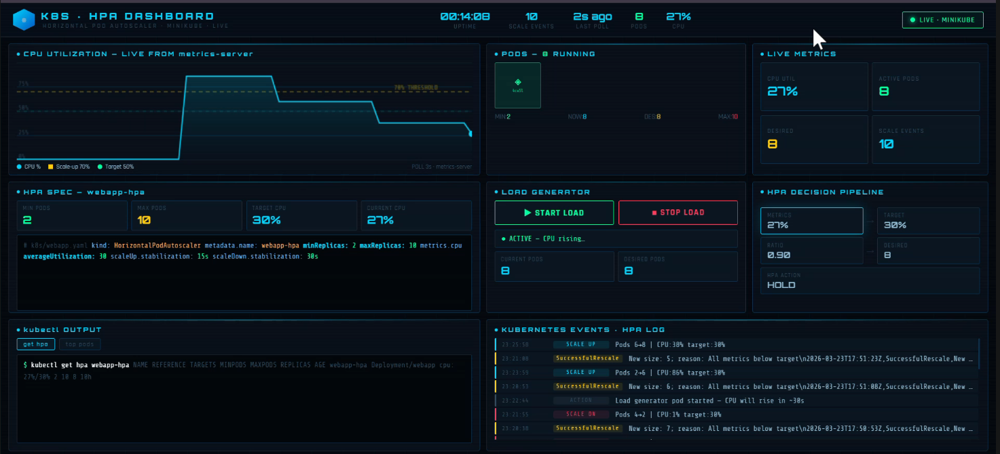
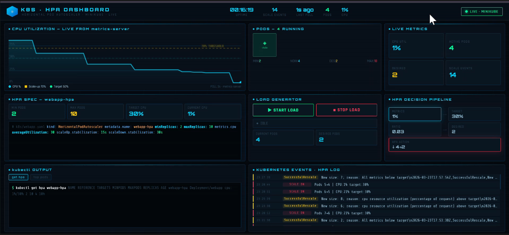

# k8s-hpa-dashboard

---

## Folder Structure
```
hpa-final/
├── k8s/
│   ├── webapp.yaml            ← Deployment + Service + HPA
│   └── load-generator.yaml    ← busybox load generator
├── backend/
│   ├── server.py              ← FastAPI WebSocket server
│   ├── requirements.txt       ← Python packages
│   └── static/
│       └── index.html         ← Live dashboard (auto-served)
└── README.md
```

---

## Prerequisites (install these first)
- Docker Desktop    → https://www.docker.com/products/docker-desktop
- minikube          → https://minikube.sigs.k8s.io/docs/start
- kubectl           → https://kubernetes.io/docs/tasks/tools
- Python 3.10+      → https://www.python.org

---

## STEP 1 — Open VS Code terminal
Press  Ctrl + `  inside VS Code

---

## STEP 2 — Start minikube (Terminal 1)
```
minikube start --driver=docker --cpus=4 --memory=4096
minikube addons enable metrics-server
```
Wait until you see:  Done! kubectl is now configured to use "minikube"

---

## STEP 3 — Deploy to Kubernetes (Terminal 1)
```
kubectl apply -f k8s/webapp.yaml
kubectl rollout status deployment/webapp
kubectl get hpa webapp-hpa
```
You will see:  NAME / TARGETS / MINPODS / MAXPODS / REPLICAS
CPU will show <unknown>/50% for ~60 seconds — that is normal.

---

## STEP 4 — Start the backend server (Terminal 2)
Split terminal in VS Code:  click the split icon  or  Ctrl+Shift+5

```
cd backend
pip install -r requirements.txt
uvicorn server:app --host 0.0.0.0 --port 8000 --reload
```
Keep this terminal open. You will see:  Uvicorn running on http://0.0.0.0:8000

---

## STEP 5 — Open the dashboard
Open your browser and go to:
```
http://localhost:8000
```
The dashboard will show LIVE · MINIKUBE in green when connected.

---

## STEP 6 — Generate load (Terminal 3)
Split another terminal:

```
kubectl apply -f k8s/load-generator.yaml
```

Watch pods scale up in real time:
```
kubectl get hpa webapp-hpa --watch
```

---

## STEP 7 — Stop load (watch pods scale down)
```
kubectl delete -f k8s/load-generator.yaml
```
Pods will scale back to 2 after ~30 seconds.

---

## Verify everything is working
```
kubectl get pods
kubectl get hpa
kubectl top pods
```

---

## Cleanup when done
```
kubectl delete -f k8s/webapp.yaml
kubectl delete -f k8s/load-generator.yaml
minikube stop
```
## Screenshots

### Live Dashboard


### Pod Scaling Under Load


### Pod Scaling stops after threshold


### Pod Downscaling Under Load

